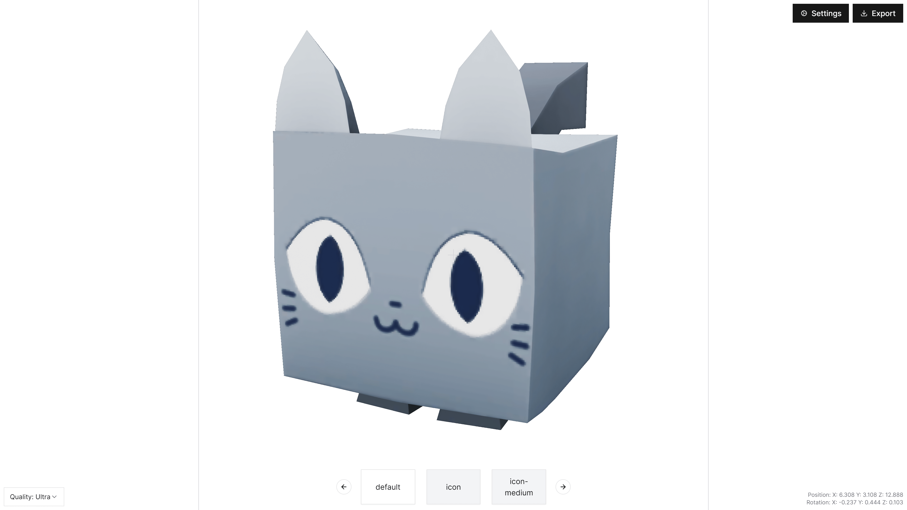

# Roblox Model Renderer

[Live Website](https://roblox-model-renderer.vercel.app/) •
[Overview](#overview) •
[Getting Started](#getting-started)

# Overview

This repository contains the source code for the Roblox Model Renderer project. It is built using
[Next.js](https://nextjs.org/), [Tailwind CSS](https://tailwindcss.com/), and
[React Three Fiber](https://docs.pmnd.rs/react-three-fiber/getting-started/introduction).
